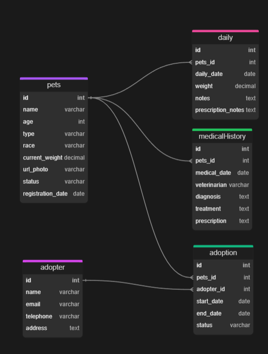

# **PURRFECT CARE**
Um sistema open-source para gerenciamento de gatinhos, com o objetivo de cadastrar, acompanhar, gerenciar gatinhos, entre outras funções que serão adicionadas futuramente. 
Será desenvolvido com um front-end e back-end em Next.js e um banco hospedado no PostgreSQL.

# BANCO DE DADOS
O banco de dados vai armazenar os dados principais do gerenciamento dos gatinhos, como dados pessoais, histórico médico, processo de adoção e dos adotantes. Vai ser usado **PostgreSQL** por ser um banco de dados relacional robusto e mais utilizado para aplicações web com **Next.js**.

## Entidades

**Gato**: Representa cada animal cadastrado

**Adotante**: Representa quem adotou o animal, ou tem interesse

**Diário**: Todos os registros sobre alimentação, medicamentos, peso, etc.

**Histórico Medico**: Todas as informações sobre consultas, diagnósticos, tratamentos, etc.

**Adoção**: Entidade responsável por conectar o Gato e o Adotante

## Atributos

**Gato**:
* id (PK)
* nome
* idade
* raça
* peso_atual
* foto_url
* status(disponível, em adoção, adotato)
* data_cadastro

**Adotante**:
* id (PK)
* nome
* email
* telefone
* endereco

**Diario**:

* id (PK)
* gato_id (FK-Gato.id)
* data_registro
* peso
* medicamento (texto livre)
* receita (texto livre)

**Histórico Medico**
* id (PK)
* gato_id (FK-Gato.id)
* data_consulta
* veterinario
* diagnostico
* tratamento

**Adoção**
* id(PK)
* gato_id (FK-Gato.id)
* adotante_id (FK-Adotante.id)
* data_inicio
* data_fim (se houver)
* status (ativa, finalizada, cancelada)

## Relacionamentos
* Gato - Diario > 1:N (um gato pode ter vários registros no diário)
* Gato - Historico Médico > 1:N (um gato pode ter várias consultas)
* Gato - Adoção - Adotante > N:M (um gato pode estar associado a diferentes adotantes adotantes, dependendo. Assim como um adotante pode ter vários gatos)

## DER - Diagrama Entidade-Relacionamento

